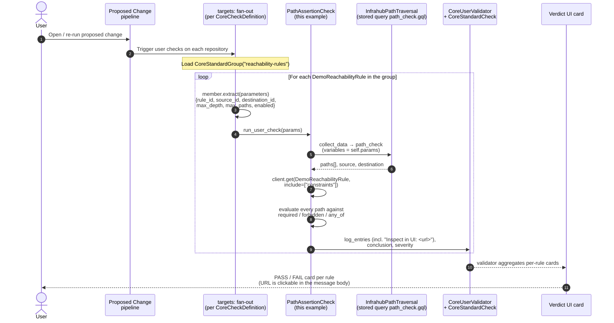

# Reachability Check — via Graph Traversal

A drop-in pattern that turns reachability invariants ("must transit AS X",
"may never transit AS Y") into Infrahub checks. Rules live in the graph
as first-class objects, are diffable on every branch, and the check fans
out per rule on every proposed change.

Built on the Infrahub 1.10 surface: stored GraphQL queries,
`InfrahubPathTraversal`, `CoreCheckDefinition` with `targets:`, and a
user-extended schema. No backend changes — copy this repo into your
own Infrahub-controlled repo and register it.

📺 **Watch the walkthrough:** [Reachability Check via Graph Traversal on YouTube](https://www.youtube.com/watch?v=guyEHTsqruI)
— the video covers the same flow as the rest of this README, end to end,
including the proposed-change verdict cards and the RBAC narrative.

---

## When / why teams need this

Network and platform engineers care about questions like:

- "Can `atl1-edge1` reach `jfk1-edge1`, and is the path the path we approved?"
- "Does every customer's traffic still avoid AS8220 (Colt) end-to-end?"
- "Did this PR accidentally introduce a path through the firewall bypass?"

These are **invariants over the graph** — properties that must hold
across the topology after every change. They are easy to write down on
paper, easy to enforce at runtime once traffic flows, and **hard to catch
at change-review time** before the change merges.

## How teams do it today

Without something like this pattern, reachability assertions live in
people, not in the system:

- **Slack threads and tribal knowledge**: "Don't merge this until you
  check that atl1 still hits jfk1 via 64496." A senior engineer
  eyeballs the diff. The newer engineer doesn't even know to ask.
- **Post-deploy fire-fighting**: the change merges, monitoring catches
  the broken path 20 minutes later, somebody rolls back.
- **One-off scripts**: a Python script in `~/scripts/` that nobody else
  runs, against a `netdb` snapshot that drifted from production three
  releases ago.
- **Diagrams in Confluence**: out of date the day after they're drawn,
  and disconnected from the data that drives the network.

The common failure mode is the same: the invariants are *not authored
where the change is reviewed*. By the time anyone notices, the change
is already in.

## What you get with Infrahub

This pattern turns each reachability invariant into a graph node that
participates in the normal Infrahub workflow:

- **Rules are objects** (`DemoReachabilityRule`) with `source`,
  `destination`, traversal depth/cap, and zero or more `constraints`.
  Both endpoints are `peer: CoreNode` — a rule can connect any two node
  kinds (device-to-device, prefix-to-device, AS-to-AS — your call).
- **Constraints are children of the rule** (`DemoReachabilityConstraint`)
  with three polarities: `required` (path must include a matching hop),
  `forbidden` (no returned path may include one — *global invariant*),
  and `any_of` (at least one option must match per path).
- **The check runs on every proposed change**. The Infrahub pipeline
  fans the check out per rule via the `reachability-rules`
  `CoreStandardGroup`. Each rule yields a PASS/FAIL verdict card on the
  PC. The FAIL message names the offending path and includes a clickable
  URL that opens the same hops in the path-traversal UI.
- **Rules diff on branches like any other object**. Tightening a rule
  (lowering `max_depth`, adding a forbidden hop) is itself a
  PR-reviewable change — and that PR runs the check too, so the team
  sees what the *new* rule would have done against the topology.
- **Click-through from the verdict to the failing path.** The check
  emits an `Inspect in UI: <url>` line that opens the path-traversal
  page pre-filtered to the same source / destination / depth /
  excluded-kinds the check evaluated.

### RBAC — who gets to author the rules

The reachability rules themselves are a sensitive surface: if any
engineer can edit them, the check becomes advisory rather than
enforceable. Infrahub's role-based object permissions solve this at
the schema-kind level.

The shape is:

- **Engineers** keep their existing read-write role across the rest of
  the network graph (devices, interfaces, BGP sessions, …).
- The "Global read-write" role gets a small set of **DENY** object
  permissions on the rule surface — typically `Demo:ReachabilityRule`
  and `Demo:ReachabilityConstraint`, on `create`, `update`, and
  `delete`. DENY beats ALLOW.
- **Super Administrators** retain authoring access via their
  wildcard-allow permission.

The net effect: engineers can author topology changes that *trigger*
the check, and watch it pass or fail on every PC — but they cannot
silently weaken the assertions to make their own PC merge. The
authoring of new rules is itself a separate, reviewable workflow done
by a smaller group.

You configure this with Infrahub's standard role / object-permission
UI (or via `CoreAccountRole` + `CoreObjectPermission` nodes loaded
through the SDK). Concretely:

- 6 deny permissions, one per `{ReachabilityRule, ReachabilityConstraint}`
  × `{create, update, delete}`, all `decision: Deny`,
  `namespace: Demo`, attached to whichever role(s) your engineers hold.

See the Infrahub docs for role/permission authoring details — the
mechanism is the same one you'd use to lock down any other kind.

## How it works under the hood



### Data model and runtime view

```mermaid
graph TB
    subgraph SCH ["Schema (authored once)"]
        direction TB
        Group[("CoreStandardGroup<br/>reachability-rules")]
        Rule["<b>DemoReachabilityRule</b><br/>name • max_depth<br/>max_paths • enabled"]
        Constraint["<b>DemoReachabilityConstraint</b><br/>polarity = required &#124; forbidden &#124; any_of<br/>hop_kind • attribute_name • attribute_value"]
        Source(("source<br/>peer: CoreNode"))
        Dest(("destination<br/>peer: CoreNode"))
        Group -- members --> Rule
        Rule -- "source (Attribute, one)" --> Source
        Rule -- "destination (Attribute, one)" --> Dest
        Rule -- "constraints (Component, many)" --> Constraint
    end

    subgraph RUN ["Runtime: example path atl1-edge1 → jfk1-edge1"]
        direction LR
        H0["atl1-edge1<br/>(InfraDevice)"] --> H1["Eth1/1<br/>(InfraInterface)"]
        H1 --> H2["AS64496<br/>(InfraAutonomousSystem)"]
        H2 --> H3["Eth0/2<br/>(InfraInterface)"]
        H3 --> H4["jfk1-edge1<br/>(InfraDevice)"]
    end

    subgraph EVAL ["Evaluation, one constraint at a time"]
        direction TB
        Req["<b>required</b> hop_kind=AS asn=64496<br/>→ AS64496 hop present ✔"]
        Fbd["<b>forbidden</b> hop_kind=AS asn=65999<br/>→ no matching hop ✔"]
        Anyo["<b>any_of</b> {asn=65001, asn=65002}<br/>→ at least one match required"]
    end

    Constraint -. "evaluated against every<br/>returned path" .-> RUN
    H2 -. "matches" .-> Req

    classDef schema fill:#e1f5fe,stroke:#0288d1
    classDef runtime fill:#e8f5e8,stroke:#388e3c
    classDef eval fill:#fff3e0,stroke:#f57c00
    class Group,Rule,Constraint,Source,Dest schema
    class H0,H1,H2,H3,H4 runtime
    class Req,Fbd,Anyo eval
```



## Constraint polarities

| Polarity   | Semantics                                                        |
| ---------- | ---------------------------------------------------------------- |
| `required` | At least one returned path must contain a matching hop.          |
| `forbidden`| **No** returned path may contain a matching hop (global).        |
| `any_of`   | At least one `any_of` constraint must match per path.            |

A constraint matches a hop when `hop["kind"] == hop_kind`. If
`attribute_name` is set, the hop node's attribute value must also equal
`attribute_value` (compared as strings after boolean normalization).

## Repository layout

```text
reachability_check/
  .infrahub.yml              # registers schema, query, check, menu
  .gitignore                 # excludes __pycache__
  schemas/reachability.yml   # DemoReachabilityRule + DemoReachabilityConstraint
  menus/reachability.yml     # "Reachability Check" sidebar entry → rule list
  queries/path_check.gql     # parameterised InfrahubPathTraversal
  checks/path_assertion.py   # PathAssertionCheck
  data/group.yml             # the reachability-rules group
  data/rules.yml             # rule instances (source/destination by hfid)
  data/constraints.yml       # per-rule hop predicates
  scripts/bootstrap.py       # resolves hfids → UUIDs and creates rules/constraints
```

## How to deploy this in your Infrahub

The example references device hfids (e.g. `atl1-edge1`). Replace them
with hfids that exist in your instance — and feel free to change the
kinds entirely; the schema accepts any peer.

```bash
# 1. Add this repo to your Infrahub-controlled git repository (either
#    drop the files into an existing CoreRepository, or register this
#    repo URL as a new CoreRepository in the Infrahub UI). On every
#    commit, .infrahub.yml is re-loaded: schema, query, check, menu.

# 2. Load the group and (templated) rules/constraints, OR run the
#    bootstrap script which resolves hfids → UUIDs and creates the
#    rules + constraints via the SDK:
infrahubctl object load data/group.yml
INFRAHUB_ADDRESS=... INFRAHUB_API_TOKEN=... \
    uv run python scripts/bootstrap.py

# 3. Open a proposed change. The check fires once per rule and reports
#    PASS / FAIL with the actual paths in the verdict message.
```

### Renaming the rule kinds

`queries/path_check.gql` hard-codes
`excluded_kinds: ["DemoReachabilityRule", "DemoReachabilityConstraint", "InfraPlatform"]`.
Without these exclusions, the path-traversal engine treats the rule
node itself as a hop between source and destination — because the rule
has cardinality-one relationships to both — and every reachability
assertion collapses to a trivial "the rule connects them" path.
`InfraPlatform` is also excluded because every device on the same
vendor stack shares a platform node and the traversal would otherwise
prefer that 2-hop shortcut.

If you change the namespace or rename the kinds, update **three**
places in lock-step:

1. `excluded_kinds` array in `queries/path_check.gql` (what the check evaluates)
2. `EXCLUDED_KINDS` tuple in `checks/path_assertion.py` (what the verdict URL emits)
3. `kind:` strings in `schemas/reachability.yml`, `data/*.yml`, and the
   `class PathAssertionCheck` references

## Honest limitations

- **Stored `.gql` is mandatory** on the `main` branch pattern. Infrahub's
  repo sync resolves the check's `query` attribute against a registered
  `CoreGraphQLQuery`. (The `demo` branch of this repo shows an
  alternative using the SDK 1.22 `traverse_paths()` API directly.)
- **No "what-if" preview outside a proposed change.** The check fires
  inside the proposed-change pipeline. To explore a path on a branch
  interactively, query `InfrahubPathTraversal` directly from the GraphQL
  playground.
- **No baseline diff.** "Did the path change since the last proposed
  change?" is not part of this example. Storing prior paths as artifacts
  or as a sibling node kind would let a second check compare.
- **`max_paths` is a real cap.** The traversal returns at most
  `max_paths` paths; the check evaluates what it gets. Raise `max_paths`
  per rule if you suspect you're missing paths, at the cost of
  traversal latency.
- **`hop_kind` choices are static.** The schema declares a `Dropdown`
  of common kinds. Adding a new topology kind requires extending the
  `choices` list. If you frequently add new kinds, consider switching
  to `Text`.

## Try the demo

The `demo` branch of this repo ships a `docker-compose.yml` pinned to
Infrahub 1.10, a small seed dataset, and a check rewritten against the
1.22 SDK's new `traverse_paths()` API. Check out the branch, run
`docker compose up`, and the full walkthrough lives in `DEMO.md`.
