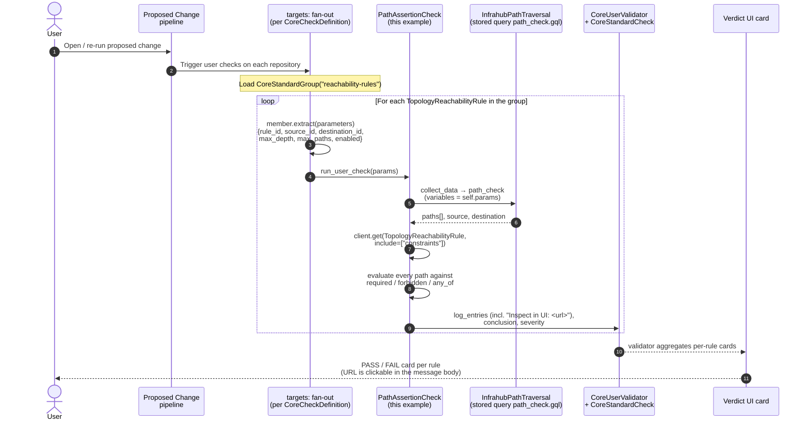

# Reachability Check: via Graph Traversal

**Reachability is a topology notation.** Anywhere your source of truth
is a graph (networks, compliance flows, security zones, link capacity,
service dependencies), the question "does *X* reach *Y* subject to
these constraints?" is the same question. This repository turns that
question into a first-class Infrahub object. It is diffable on every
branch and evaluated on every proposed change.

The pattern is built on the Infrahub 1.10 surface: stored GraphQL
queries, `InfrahubPathTraversal`, `CoreCheckDefinition` with
`targets:`, a user-extended schema, and a Python computed-attribute
transform. No backend changes are required. Copy this repository
into your own Infrahub-controlled repository and register it.

📺 **Watch the walkthrough:** [Reachability Check via Graph Traversal on YouTube](https://www.youtube.com/watch?v=guyEHTsqruI).
The video covers the same flow as the rest of this README, end to end,
including the proposed-change verdict cards and the RBAC narrative.

---

## What "reachability" buys you, across domains

Reachability is not a network-only idea. The pattern shipped here
expresses *any* graph invariant of the form "from this source, with
these allowed or forbidden hops, can I get to that destination?".
The same rule and check machinery evaluates them all. Representative
examples teams typically ask for:

- **Routing / transit assertions**: "Atlanta-to-NYC must transit AS64496
  and never AS8220." The worked example in this repo.
- **Firewall & compliance**: "Every customer-to-database flow path
  must transit `fw-zone`, and no path may bypass it." Same shape, just
  swap source/destination/constraint kinds.
- **Capacity reachability**: "Atlanta must reach NYC with at least
  10 Gb/s of usable transit capacity along the path." Source: the
  device. Destination: the device. Constraints: a hop predicate that
  reads link `bandwidth` attribute.
- **Tenant & zone segmentation**: "Tenant A's data plane is *never*
  reachable from tenant B's, at any depth." A `forbidden` rule with
  source/destination spanning the two zones.
- **Service & dependency graphs**: "Order-service must reach
  payment-service via approved internal APIs only, never via the public
  egress proxy."
- **Continuous compliance audits**: every rule, every proposed change,
  with a full diffable history of which paths held when.

All of those use cases share **the same notation**:
`source → destination + hop predicates`, applied to different parts
of the graph. Slide 17 of the demo deck enumerates these as
"one pattern, many invariants" for exactly this reason.

## How teams do this today (without the pattern)

Whichever domain you pick, the version of the workflow without
Infrahub looks the same:

- **Slack threads and tribal knowledge**: "Do not merge this until you
  check that the flow still terminates at `fw-zone`." A senior engineer
  eyeballs the diff. The newer engineer does not even know to ask.
- **Post-deploy fire-fighting**: the change merges, monitoring catches
  the broken path 20 minutes later, somebody rolls back.
- **One-off scripts**: a Python script in `~/scripts/` that nobody else
  runs, against a snapshot of the source of truth that drifted from
  production three releases ago.
- **Diagrams in Confluence**: out of date the day after they are drawn,
  and disconnected from the data that drives the deployment.

The common failure mode: the invariants are *not authored where the
change is reviewed*. By the time anyone notices, the change is in.

## What you get with Infrahub

This pattern turns each reachability invariant, wherever it lives in
your graph, into a node that participates in the normal Infrahub
workflow:

- **Rules are objects** (`TopologyReachabilityRule`) with `source`,
  `destination`, traversal depth and cap, and zero or more
  `constraints`. Both endpoints are `peer: CoreNode`, so a rule can
  connect any two node kinds in your graph (device-to-device,
  flow-to-firewall-zone, service-to-service, tenant-to-tenant, or
  prefix-to-device, depending on the use case).
- **Constraints are children of the rule** (`TopologyReachabilityConstraint`)
  with three polarities: `required` (path must include a matching hop),
  `forbidden` (no returned path may include one; a *global invariant*),
  and `any_of` (at least one option must match per path).
- **The check runs on every proposed change**. The Infrahub pipeline
  fans the check out per rule via the `reachability-rules`
  `CoreStandardGroup`. Each rule yields a PASS/FAIL verdict card on the
  PC. The FAIL message names the offending path and includes a clickable
  URL that opens the same hops in the path-traversal UI.
- **Rules diff on branches like any other object**. Tightening a rule
  (lowering `max_depth`, adding a forbidden hop) is itself a
  PR-reviewable change, and that PR runs the check too, so the team
  sees what the *new* rule would have done against the topology.
- **Click-through from the verdict to the failing path.** The check
  emits an `Inspect in UI: <url>` line that opens the path-traversal
  page pre-filtered to the same source / destination / depth /
  excluded-kinds the check evaluated.

### Separation of duties: three roles, one workflow

Each role owns one layer, so engineers can move fast without breaking
topologies. The engineer making a change cannot loosen the guardrail
that checks it.

1. **Automation specialist.** Builds the path-traversal check *once*.
   The logic that turns the graph into a verdict lives in this
   repository: `checks/path_assertion.py`, the stored `path_check`
   query, the `path_traversal_url` transform, and the schema
   extension. Reviewed like any other code change.
2. **Operations team.** Defines the *dynamic rules*: which paths must
   hold, which transits are forbidden, how deep to look. They author
   `TopologyReachabilityRule` and `TopologyReachabilityConstraint`
   instances in the graph. The rules themselves are diffable,
   branchable, and audit-logged.
3. **Network engineers.** Change the *intent data*: device ASNs,
   interfaces, BGP sessions, the whole topology graph. They do not
   need to worry about breaking topologies, because the rules catch
   any violation on every proposed change.

### RBAC: locking the rule surface down

The reachability rules themselves are a sensitive surface: if any
engineer can edit them, the check becomes advisory rather than
enforceable. Infrahub's role-based object permissions solve this at
the schema-kind level.

The shape is:

- **Network engineers** keep their existing read-write role across the
  rest of the network graph (devices, interfaces, BGP sessions, …).
- The "Global read-write" role gets a small set of **DENY** object
  permissions on the rule surface, typically `Topology:ReachabilityRule`
  and `Topology:ReachabilityConstraint`, on `create`, `update`, and
  `delete`. DENY beats ALLOW.
- The **Operations team** has authoring access (allow on the rule
  surface). **Super Administrators** retain authoring access via their
  wildcard-allow permission.

The net effect: network engineers can author topology changes that
*trigger* the check and watch it pass or fail on every proposed
change, but they cannot silently weaken the assertions to make their
own change merge. The authoring of new rules is a separate,
reviewable workflow owned by the operations team.

You configure this with Infrahub's standard role / object-permission
UI (or via `CoreAccountRole` + `CoreObjectPermission` nodes loaded
through the SDK). Concretely:

- 6 deny permissions, one per `{ReachabilityRule, ReachabilityConstraint}`
  × `{create, update, delete}`, all `decision: Deny`,
  `namespace: Topology`, attached to whichever role(s) your engineers hold.

See the Infrahub documentation for role and permission authoring
details. The mechanism is the same one you would use to lock down
any other kind.

> **Works in Infrahub today, with no product changes.** The three-role
> separation is enforced entirely by built-in object permissions; the
> rules themselves are graph nodes; the check is a normal
> `CoreCheckDefinition`.

## How it works under the hood



### Data model and runtime view

```mermaid
graph TB
    subgraph SCH ["Schema (authored once)"]
        direction TB
        Group[("CoreStandardGroup<br/>reachability-rules")]
        Rule["<b>TopologyReachabilityRule</b><br/>name • max_depth<br/>max_paths • enabled"]
        Constraint["<b>TopologyReachabilityConstraint</b><br/>polarity = required &#124; forbidden &#124; any_of<br/>hop_kind • attribute_name • attribute_value"]
        Source(("source<br/>peer: CoreNode"))
        Dest(("destination<br/>peer: CoreNode"))
        Group -- members --> Rule
        Rule -- "source (Attribute, one)" --> Source
        Rule -- "destination (Attribute, one)" --> Dest
        Rule -- "constraints (Component, many)" --> Constraint
    end

    subgraph RUN ["Runtime: example path atl1-edge1 → jfk1-edge1"]
        direction LR
        H0["atl1-edge1<br/>(InfraDevice)"] --> H1["Eth1/1<br/>(InfraInterface)"]
        H1 --> H2["AS64496<br/>(InfraAutonomousSystem)"]
        H2 --> H3["Eth0/2<br/>(InfraInterface)"]
        H3 --> H4["jfk1-edge1<br/>(InfraDevice)"]
    end

    subgraph EVAL ["Evaluation, one constraint at a time"]
        direction TB
        Req["<b>required</b> hop_kind=AS asn=64496<br/>→ AS64496 hop present ✔"]
        Fbd["<b>forbidden</b> hop_kind=AS asn=65999<br/>→ no matching hop ✔"]
        Anyo["<b>any_of</b> {asn=65001, asn=65002}<br/>→ at least one match required"]
    end

    Constraint -. "evaluated against every<br/>returned path" .-> RUN
    H2 -. "matches" .-> Req

    classDef schema fill:#e1f5fe,stroke:#0288d1
    classDef runtime fill:#e8f5e8,stroke:#388e3c
    classDef eval fill:#fff3e0,stroke:#f57c00
    class Group,Rule,Constraint,Source,Dest schema
    class H0,H1,H2,H3,H4 runtime
    class Req,Fbd,Anyo eval
```



## Constraint polarities

| Polarity (UI label) | Enum name   | Semantics                                                 |
| ------------------- | ----------- | --------------------------------------------------------- |
| **Required hop**    | `required`  | At least one returned path must contain a matching hop.   |
| **Forbidden hop**   | `forbidden` | **No** returned path may contain a matching hop (global). |
| **Any-of hop**      | `any_of`    | At least one `any_of` predicate must match per path.      |

A constraint matches a hop when `hop["kind"] == hop_kind`. If
`attribute_name` is set, the hop node's attribute value must also equal
`attribute_value` (compared as strings after boolean normalization).

## Repository layout

```text
reachability_check/
  .infrahub.yml                       # registers schema, query, check, menu, transform
  .gitignore                          # excludes __pycache__
  schemas/reachability.yml            # TopologyReachabilityRule + TopologyReachabilityConstraint
  menus/reachability.yml              # "Reachability Check" sidebar entry → rule list
  queries/path_check.gql              # parameterised InfrahubPathTraversal (used by the check)
  queries/rule_url.gql                # fetches rule data for the URL transform
  transforms/path_traversal_url.py    # Python computed-attribute transform (server-side)
  checks/path_assertion.py            # PathAssertionCheck
  data/group.yml                      # the reachability-rules group
  data/rules.yml                      # rule instances (source/destination by hfid)
  data/constraints.yml                # per-rule hop predicates
  scripts/bootstrap.py                # resolves hfids → UUIDs and creates rules/constraints
```

## Click-through URL: a Python computed attribute

Each rule exposes a `path_traversal_url` attribute that opens
`/path-traversal` pre-filtered to the rule's source / destination /
depth / max-paths / excluded-kinds. The value is **computed
server-side** by a Python transform
(`transforms/path_traversal_url.py`), registered in `.infrahub.yml`
as a `python_transform` and wired into the schema with:

```yaml
- name: path_traversal_url
  kind: Text
  read_only: true
  computed_attribute:
    kind: TransformPython
    transform: path_traversal_url
```

Whenever any of the rule's inputs change (source, destination,
max_depth, max_paths), Infrahub's task workers re-run the transform
and update the value. The check reads it directly from the rule
(`rule.path_traversal_url.value`) when building the verdict log line.
There is no URL construction inside the check itself.

Why this matters:

- **One source of truth** for the URL. The UI sees the same string the
  check emits.
- **Branch-aware**: on a branch with a tightened `max_depth`, the URL
  reflects the branch value automatically.
- **Easier to extend**: add a new query parameter (for example, a
  constraint fingerprint) by editing the transform alone. No check
  change is required.

### Why is `path_traversal_url` empty on my rules?

A `TransformPython` computed attribute only fires after Infrahub has
processed this repository's `.infrahub.yml`. That processing happens
exclusively through a registered `CoreRepository`. If you have not yet
registered this repository, the `path_traversal_url` attribute exists
on the schema but stays `null` on every rule, and the check's verdict
message has no `Inspect in UI:` line. You can confirm this in the
GraphQL playground:

```graphql
{
  CoreRepository { count }
  CoreTransformPython(name__value: "path_traversal_url") { count }
}
```

Both counts return `0` when no `CoreRepository` is registered.

To populate the value, register the repository:

1. Push this repository to a git remote the Infrahub task workers can
   reach (a private or public GitHub or GitLab URL, a self-hosted
   Gitea, or a `git daemon` service in your own docker-compose).
2. In the Infrahub UI, navigate to **CoreRepository → + Add** (or use
   `infrahubctl repository add` / the SDK) and supply the URL and the
   branch you want Infrahub to track.
3. The task workers clone the repository, parse `.infrahub.yml`, and
   create the `CoreTransformPython`, `CoreGraphQLQuery`, and
   `CoreCheckDefinition` objects. From this moment on, every rule
   create or update fires the transform server-side and the
   `path_traversal_url` attribute is populated.

The `live-demo` branch of this repository ships a self-contained
gitserver service in its `docker-compose.yml` and a
`uv run invoke demo.register-repo` task that wires this up against
the local stack with no external dependencies. See `DEMO.md` on that
branch for the exact sequence.

## How to deploy this in your Infrahub

The example references device hfids (such as `atl1-edge1`). Replace
them with hfids that exist in your instance. The kinds themselves can
also be changed; the schema accepts any peer.

```bash
# 1. Add this repo to your Infrahub-controlled git repository (either
#    drop the files into an existing CoreRepository, or register this
#    repo URL as a new CoreRepository in the Infrahub UI). On every
#    commit, .infrahub.yml is re-loaded: schema, query, check, menu.

# 2. Load the group and (templated) rules/constraints, OR run the
#    bootstrap script which resolves hfids → UUIDs and creates the
#    rules + constraints via the SDK:
infrahubctl object load data/group.yml
INFRAHUB_ADDRESS=... INFRAHUB_API_TOKEN=... \
    uv run python scripts/bootstrap.py

# 3. Open a proposed change. The check fires once per rule and reports
#    PASS / FAIL with the actual paths in the verdict message.
```

### Tune the excluded kinds for your schema

`queries/path_check.gql` hard-codes
`excluded_kinds: ["TopologyReachabilityRule", "TopologyReachabilityConstraint", "InfraPlatform"]`.
This list controls **which node kinds the traversal will refuse to walk
through as hops**. Getting it right matters more than it looks at
first glance.

Why the defaults are what they are:

- `TopologyReachabilityRule`. Every rule has cardinality-one
  relationships to its `source` and `destination`. Without this
  exclusion, the traversal sees the rule itself as a one-hop
  shortcut between the endpoints, and every reachability assertion
  collapses to a trivial "the rule connects them" path.
- `TopologyReachabilityConstraint`. Children of the rule. Excluded
  for the same reason.
- `InfraPlatform`. In the standard `models/base` schemas, every
  device on the same vendor stack shares a platform node, so the
  traversal would prefer a two-hop `device → InfraPlatform → device`
  shortcut over the real network path. Drop this if you do not have
  `InfraPlatform` in your schema (Infrahub 1.10 rejects unknown
  `excluded_kinds` values with
  `excluded_kinds kind '<X>' not in schema`).

You will almost certainly need to **tune this list for your topology**.
Two common situations:

- **A kind in the default list does not exist in your schema.** Remove
  it, or the GraphQL call will fail outright. The `live-demo` branch
  ships a minimal schema and drops `InfraPlatform` for exactly this
  reason.
- **Your topology has its own "shortcut" kinds.** Anything that
  cardinality-many-relates a large fraction of nodes (e.g. a shared
  `Organization`, `Tag`, `Site`, `Tenant`, or a global `Vendor` node)
  will cause the traversal to prefer a short artificial path through
  it instead of the real network hops you want to assert on. Add those
  kinds to `excluded_kinds`.

When in doubt, open a path between two endpoints directly in
`/path-traversal`, look at what shows up in the depth-1 and depth-2
results, and exclude any kind that does not represent a real hop in
your domain.

If you change the namespace or rename the kinds, update **three**
places in lock-step:

1. `excluded_kinds` array in `queries/path_check.gql` (what the check evaluates)
2. `EXCLUDED_KINDS` tuple in `transforms/path_traversal_url.py` (what the verdict URL points at)
3. `kind:` strings in `schemas/reachability.yml`, `data/*.yml`, and the
   `class PathAssertionCheck` references

## Honest limitations

- **Stored `.gql` is mandatory** on the `main` branch pattern. Infrahub's
  repo sync resolves the check's `query` attribute against a registered
  `CoreGraphQLQuery`. (The `live-demo` branch of this repo shows an
  alternative using the SDK 1.22 `traverse_paths()` API directly.)
- **No "what-if" preview outside a proposed change.** The check fires
  inside the proposed-change pipeline. To explore a path on a branch
  interactively, query `InfrahubPathTraversal` directly from the GraphQL
  playground.
- **No baseline diff.** "Did the path change since the last proposed
  change?" is not part of this example. Storing prior paths as artifacts
  or as a sibling node kind would let a second check compare.
- **`max_paths` is a real cap.** The traversal returns at most
  `max_paths` paths; the check evaluates what it gets. Raise `max_paths`
  per rule if you suspect you are missing paths, at the cost of
  traversal latency.
- **`hop_kind` choices are static.** The schema declares a `Dropdown`
  of common kinds. Adding a new topology kind requires extending the
  `choices` list. If you frequently add new kinds, consider switching
  to `Text`.

## Same notation, many invariants

Every use case below is **the same reachability question**: `source →
destination + hop predicates`, pointed at a different part of the
graph. The schema, the check, the proposed-change verdict cards, the
RBAC story, and the click-through URL are identical; only the chosen
endpoints and constraint hops change.

| Use case                          | What the same rule shape expresses                                   |
| --------------------------------- | -------------------------------------------------------------------- |
| **Routing / transit (this demo)** | "Atlanta-to-NYC must transit AS64496 and never AS8220." <br/>`source: device · destination: device · constraints: AS hops` |
| **Firewall compliance**           | "Every flow path crosses the required inspection zone, never an unapproved bypass." <br/>`source: flow endpoint · constraints: must transit fw-zone, never bypass` |
| **Capacity reachability**         | "Atlanta must reach NYC along a path whose every link carries ≥10 Gb/s." <br/>`constraints: hop attribute (bandwidth) ≥ N` |
| **Tenant & zone segmentation**    | "Tenant A is never reachable from tenant B, at any depth." <br/>`forbidden: reach destination at all` |
| **Path redundancy**               | "Critical pairs keep two disjoint paths, so losing one link still satisfies the rule." <br/>`require: 2 disjoint paths` |
| **Latency & SLA bounds**          | "Reachable within a hop budget along approved low-latency transit, or the change fails." <br/>`within: N hops · constraints: transit low-latency` |
| **Maintenance drain safety**      | "Confirm dependent paths reroute before a node is drained for maintenance." <br/>`require: reroute before drain` |
| **Service & dependency graphs**   | "Order-service must reach payment-service via approved internal APIs only, never the public egress proxy." |
| **Dependency & blast-radius**     | "From any node, list everything it reaches." Uses `InfrahubReachableNodes` instead of `InfrahubPathTraversal`. <br/>`reachable from: node · target kinds` |
| **Change impact assessment**      | "Before a change merges, diff the source-to-destination paths it would break." <br/>`diff: reachable paths · before vs after` |
| **Continuous compliance**         | "Every change is checked against policy and recorded, with a full queryable audit trail." <br/>`policy holds · on every change` |

Some of these need a richer constraint vocabulary than the
`required` / `forbidden` / `any_of` polarities shipped here (e.g. a
`hop_attribute_ge` for capacity, a `disjoint_paths` count for
redundancy). The recipe for adding them is the same one used for
the existing constraints: a new `polarity` choice, a few extra fields
on `TopologyReachabilityConstraint`, and a branch in the check's
`validate()` that interprets them.

> **Future demos.** Today only the **routing / transit** scenario
> ships with a runnable docker-compose demo (the `live-demo` branch
> below). If there is demand for any of the other use-cases above,
> additional demo branches (`live-demo-firewall-compliance`,
> `live-demo-capacity-reachability`, `live-demo-tenant-segmentation`,
> etc.) will follow. Open an issue or drop a note in the OpsMill
> Discord (`discord.gg/opsmill`) to vote on which one comes next.

## Try the live demo

The [`live-demo`](../../tree/live-demo) branch of this repo ships a
`docker-compose.yml` pinned to Infrahub 1.10, a small seed dataset, and
the check wired against the 1.22 SDK's new `traverse_paths()` API. It
mirrors the three one-field scenarios from the demo video (one PASS,
two FAILs, by Sofia Hernandez, Chloe O'Brian, and Administrator).

```bash
git checkout live-demo
uv run invoke demo.up       # docker compose up + load schema + seed + create rules
open http://localhost:8000  # admin / infrahub
```

Full walkthrough lives in `DEMO.md` on that branch.
