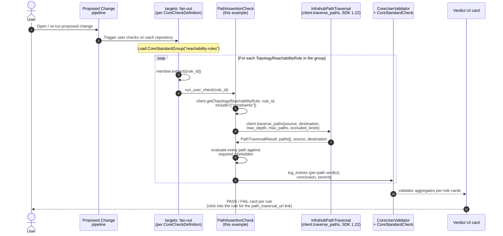

# Implementation Details

Everything an adopter needs to read once they have decided to deploy
or extend the reachability-check pattern. For the value walkthrough
and the use-case framing, see the [README](../README.md). To try the
pattern locally without reading any of this first, switch to the
[`live-demo`](../../tree/live-demo) branch and run
[`QUICKSTART.md`](../../tree/live-demo/QUICKSTART.md).

## Repository layout

The pattern is shipped as a drop-in repository. It ships the schema,
check, transform, queries, and menu, and nothing else. Adopters supply
their own `reachability-rules` `CoreStandardGroup` and their own rule
and constraint instances through the Infrahub UI, the SDK, or their
own data-loader YAML.

```text
.
├── .infrahub.yml                       # registers schema, query, check, menu, transform
├── README.md                           # purpose / value
├── docs/IMPLEMENTATION.md              # this file
├── schemas/reachability.yml            # TopologyReachabilityRule + TopologyReachabilityConstraint
├── menus/reachability.yml              # "Reachability Check" sidebar entry
├── queries/path_check.gql              # stored InfrahubPathTraversal query (placeholder)
├── queries/rule_url.gql                # query that feeds the URL transform
├── transforms/path_traversal_url.py    # Python computed-attribute transform
└── checks/path_assertion.py            # PathAssertionCheck
```

## Schema

`schemas/reachability.yml` declares two nodes in the `Topology`
namespace:

**`TopologyReachabilityRule`** — the assertion.

| Attribute / Relationship  | Kind                       | Notes                                                              |
| ------------------------- | -------------------------- | ------------------------------------------------------------------ |
| `name`                    | `Text`, unique             | Stable identifier; used as the rule's display label.               |
| `description`             | `Text`, optional           |                                                                    |
| `max_depth`               | `Number`, default 8        | Traversal depth cap.                                               |
| `max_paths`               | `Number`, default 50       | Returned-path cap.                                                 |
| `enabled`                 | `Boolean`, default true    | A disabled rule skips evaluation.                                  |
| `path_traversal_url`      | `URL`, read-only, computed | Click-through link; populated server-side by the Python transform. |
| `source`                  | `peer: CoreNode`           | Any node kind in the graph.                                        |
| `destination`             | `peer: CoreNode`           | Any node kind in the graph.                                        |
| `constraints`             | `Component`, many          | Children: `TopologyReachabilityConstraint`.                        |

**`TopologyReachabilityConstraint`** — one hop predicate per child.

| Attribute     | Kind                | Notes                                                                                  |
| ------------- | ------------------- | -------------------------------------------------------------------------------------- |
| `polarity`    | `Dropdown`          | `required` (label: "Required hop") or `forbidden` (label: "Forbidden hop").            |
| `hop_kind`    | `Dropdown`          | The schema kind a matching hop must have (e.g. `InfraAutonomousSystem`).               |
| `attribute_name` | `Text`, optional | Attribute on the hop node to compare. Omit to match by kind alone.                     |
| `attribute_value` | `Text`, optional | Expected attribute value as string. Booleans normalised in the check.                  |
| `label`       | `Text`, read-only, Jinja2 computed | Auto-derived identity used in human-friendly id and uniqueness checks. |

The polarity Dropdown ships with two choices by default
(`required` and `forbidden`). The `any_of` polarity was dropped for
simplicity; adopters who need disjunctive predicates can add it
back in a fork (`schemas/reachability.yml` plus the matching branch
in `checks/path_assertion.py:validate`).

## Check

`checks/path_assertion.py` is a `PathAssertionCheck(InfrahubCheck)`
registered in `.infrahub.yml`:

```yaml
check_definitions:
  - name: reachability_assertion
    class_name: PathAssertionCheck
    file_path: checks/path_assertion.py
    targets: reachability-rules
    parameters:
      rule_id: "id"
```

The Infrahub check runner fans the check out one invocation per
member of the `reachability-rules` `CoreStandardGroup`, passing only
the rule id into `self.params`. The check then makes three
deadline-bounded SDK calls:

1. **`client.get`** loads the rule with its constraint children
   (`include=["constraints"]`, `prefetch_relationships=True`).
2. **`client.traverse_paths`** runs `InfrahubPathTraversal` from
   `rule.source.id` to `rule.destination.id` with the rule's
   `max_depth` / `max_paths` and `EXCLUDED_KINDS`.
3. **`client.execute_graphql`** issues one batched query with one
   aliased block per distinct hop kind referenced by the rule's
   constraints, then hydrates each hop edge through
   `InfrahubNode.from_graphql` for typed attribute access.

Every call sets an explicit `timeout` (sourced from
`INFRAHUB_REACHABILITY_CHECK_TIMEOUT`, default 60 s) and a
`tracker` identifier (`reachability-check-fetch-hop-attributes`)
where the SDK accepts one, so individual calls stay traceable in
worker logs and the Prefect run tree.

### Polarity semantics

| Polarity (UI label) | Enum name   | Semantics                                                 |
| ------------------- | ----------- | --------------------------------------------------------- |
| **Required hop**    | `required`  | At least one returned path must contain a matching hop.   |
| **Forbidden hop**   | `forbidden` | **No** returned path may contain a matching hop (global). |

`forbidden` is a global invariant: a single offending hop on any
returned path fails the check, even if other paths satisfy
`required`. `required` keeps existence semantics: at least one path
must include all required hops.

A constraint matches a hop when `hop.kind == constraint.hop_kind`.
If `attribute_name` is set, the hop node's value for that attribute
must also equal `attribute_value` (compared as strings after
boolean normalisation).

## Transform

`transforms/path_traversal_url.py` is a `PathTraversalUrl(InfrahubTransform)`
registered in `.infrahub.yml`:

```yaml
python_transforms:
  - name: path_traversal_url
    class_name: PathTraversalUrl
    file_path: transforms/path_traversal_url.py
```

The schema's `path_traversal_url` attribute references it:

```yaml
- name: path_traversal_url
  kind: URL
  read_only: true
  computed_attribute:
    kind: TransformPython
    transform: path_traversal_url
```

Infrahub invokes the transform whenever any of the rule's inputs
change (source, destination, max_depth, max_paths). The transform
reads them off the `rule_url` GraphQL response and emits a
**relative URL** of the form
`/path-traversal?source=...&destination=...&depth=N&maxPaths=N&excludedKinds=...`.
The Infrahub UI resolves the relative URL against the current page,
so the same value works on `http://localhost:8000`, on
`https://infrahub.your-company.com`, and on any other host without
environment-variable configuration.

The URL lives only on the rule detail page. The check does not
embed it in its verdict log because a relative URL pasted into a
log would lose its host context outside the UI.

## How it works under the hood



### Data model and runtime view

```mermaid
graph TB
    subgraph SCH ["Schema (authored once)"]
        direction TB
        Group[("CoreStandardGroup<br/>reachability-rules")]
        Rule["<b>TopologyReachabilityRule</b><br/>name • max_depth<br/>max_paths • enabled"]
        Constraint["<b>TopologyReachabilityConstraint</b><br/>polarity = required &#124; forbidden<br/>hop_kind • attribute_name • attribute_value"]
        Source(("source<br/>peer: CoreNode"))
        Dest(("destination<br/>peer: CoreNode"))
        Group -- members --> Rule
        Rule -- "source (Attribute, one)" --> Source
        Rule -- "destination (Attribute, one)" --> Dest
        Rule -- "constraints (Component, many)" --> Constraint
    end

    subgraph RUN ["Runtime: example path atl1-edge1 → jfk1-edge1"]
        direction LR
        H0["atl1-edge1<br/>(InfraDevice)"] --> H1["Eth1/1<br/>(InfraInterface)"]
        H1 --> H2["AS64496<br/>(InfraAutonomousSystem)"]
        H2 --> H3["Eth0/2<br/>(InfraInterface)"]
        H3 --> H4["jfk1-edge1<br/>(InfraDevice)"]
    end

    subgraph EVAL ["Evaluation, one constraint at a time"]
        direction TB
        Req["<b>required</b> hop_kind=AS asn=64496<br/>→ AS64496 hop present ✔"]
        Fbd["<b>forbidden</b> hop_kind=AS asn=65999<br/>→ no matching hop ✔"]
    end

    Constraint -. "evaluated against every<br/>returned path" .-> RUN
    H2 -. "matches" .-> Req

    classDef schema fill:#e1f5fe,stroke:#0288d1
    classDef runtime fill:#e8f5e8,stroke:#388e3c
    classDef eval fill:#fff3e0,stroke:#f57c00
    class Group,Rule,Constraint,Source,Dest schema
    class H0,H1,H2,H3,H4 runtime
    class Req,Fbd eval
```



## Why is `path_traversal_url` empty on my rules?

A `TransformPython` computed attribute only fires after Infrahub has
processed this repository's `.infrahub.yml`. That processing happens
exclusively through a registered `CoreRepository`. If you have not yet
registered this repository, the `path_traversal_url` attribute exists
on the schema but stays `null` on every rule, and the rule detail
page has no clickable link to `/path-traversal`. You can confirm
this in the GraphQL playground:

```graphql
{
  CoreRepository { count }
  CoreTransformPython(name__value: "path_traversal_url") { count }
}
```

Both counts return `0` when no `CoreRepository` is registered.

To populate the value, register the repository:

1. Push this repository to a git remote the Infrahub task workers
   can reach (a private or public GitHub or GitLab URL, a
   self-hosted Gitea, or any other git server). A `file://` URL
   pointing at a path bind-mounted into the worker container also
   works; see the `live-demo` branch for a working example.
2. Run `infrahubctl repository add reachability-check <URL>` (the
   SDK and UI offer the same operation). Optionally pass
   `--ref <branch>` if the worker should track a branch other than
   the repository's default.
3. The task workers clone the repository, parse `.infrahub.yml`, and
   create the `CoreTransformPython`, `CoreGraphQLQuery`, and
   `CoreCheckDefinition` objects. From this moment on, every rule
   create or update fires the transform server-side and
   `path_traversal_url` is populated.

The `live-demo` branch automates all of this against a local docker
stack. It bind-mounts a single-branch bare clone of the repository
into the task-worker container and runs `infrahubctl repository add
reachability-check file:///srv/reachability` from a
`uv run invoke demo.register-repo` task. See
[`QUICKSTART.md`](../../../tree/live-demo/QUICKSTART.md) on that
branch for the exact sequence.

## Tune the excluded kinds for your schema

The repository ships with a minimal default:
`excluded_kinds: ["TopologyReachabilityRule", "TopologyReachabilityConstraint"]`.
This list controls **which node kinds the traversal refuses to walk
through as hops**. Getting it right matters more than it looks at
first glance.

**Why these two are excluded by default:**

- `TopologyReachabilityRule`. Every rule has cardinality-one
  relationships to its `source` and `destination`. Without this
  exclusion, the traversal sees the rule itself as a one-hop
  shortcut between the endpoints, and every reachability assertion
  collapses to a trivial "the rule connects them" path.
- `TopologyReachabilityConstraint`. Children of the rule. Excluded
  for the same reason.

**You will almost certainly need to extend this list for your
topology.** The Infrahub GraphQL server rejects `excluded_kinds`
values that are not in the loaded schema, so the defaults stay
minimal; you add the shortcut kinds your schema actually has.

The single most common extension for the standard `models/base`
schemas is `InfraPlatform`. Every device on the same vendor stack
shares a platform node, so without excluding it the traversal would
prefer a two-hop `device → InfraPlatform → device` shortcut over
the real network path. Other typical shortcut kinds: a shared
`Organization`, `Tag`, `Site`, `Tenant`, or a global `Vendor` node.
Anything that cardinality-many-relates a large slice of the graph
belongs on the list.

When in doubt, open `/path-traversal` between two endpoints directly,
look at what shows up in the depth-1 and depth-2 results, and exclude
any kind that does not represent a real hop in your domain.

Three places stay in lock-step. Update all three together when you
extend the list (or when you rename the rule or constraint kinds in
your fork):

1. `excluded_kinds` array in `queries/path_check.gql` (the stored
   query, kept for the `CoreCheckDefinition` `query` attribute even
   though the check itself uses `traverse_paths`).
2. `EXCLUDED_KINDS` tuple in `transforms/path_traversal_url.py`
   (what the verdict URL points at).
3. `EXCLUDED_KINDS` tuple in `checks/path_assertion.py` (what the
   check actually passes to `client.traverse_paths()`).

## RBAC — separation of duties and lock-down

### Separation of duties: three roles, one workflow

Each role owns one layer, so engineers can move fast without breaking
topologies. The engineer making a change cannot loosen the guardrail
that checks it.

1. **Automation specialist.** Builds the path-traversal check *once*.
   The logic that turns the graph into a verdict lives in this
   repository: `checks/path_assertion.py`, the stored `path_check`
   query, the `path_traversal_url` transform, and the schema
   extension. Reviewed like any other code change.
2. **Operations team.** Defines the *dynamic rules*: which paths
   must hold, which transits are forbidden, how deep to look. They
   author `TopologyReachabilityRule` and
   `TopologyReachabilityConstraint` instances in the graph. The
   rules are diffable, branchable, and audit-logged.
3. **Network engineers.** Change the *intent data*: device ASNs,
   interfaces, BGP sessions, the whole topology graph. They do not
   need to worry about breaking topologies, because the rules catch
   any violation on every proposed change.

### Locking the rule surface down

The reachability rules themselves are a sensitive surface: if any
engineer can edit them, the check becomes advisory rather than
enforceable. Infrahub's role-based object permissions solve this at
the schema-kind level.

The shape:

- **Network engineers** keep their existing read-write role across
  the rest of the network graph (devices, interfaces, BGP sessions,
  and so on).
- The "Global read-write" role gets a small set of **DENY** object
  permissions on the rule surface, typically
  `Topology:ReachabilityRule` and `Topology:ReachabilityConstraint`,
  on `create`, `update`, and `delete`. DENY beats ALLOW.
- The **Operations team** has authoring access (allow on the rule
  surface). **Super Administrators** retain authoring access via
  their wildcard-allow permission.

The net effect: network engineers can author topology changes that
*trigger* the check and watch it pass or fail on every proposed
change, but they cannot silently weaken the assertions to make their
own change merge. The authoring of new rules is a separate,
reviewable workflow owned by the operations team.

You configure this with Infrahub's standard role / object-permission
UI (or via `CoreAccountRole` + `CoreObjectPermission` nodes loaded
through the SDK). Concretely:

- 6 deny permissions, one per
  `{ReachabilityRule, ReachabilityConstraint}` × `{create, update, delete}`,
  all `decision: Deny`, `namespace: Topology`, attached to whichever
  role(s) your engineers hold.

See the Infrahub documentation for role and permission authoring
details. The mechanism is the same one you would use to lock down
any other kind.

> **Works in Infrahub today, with no product changes.** The
> three-role separation is enforced entirely by built-in object
> permissions; the rules themselves are graph nodes; the check is a
> normal `CoreCheckDefinition`.

## How to deploy in your Infrahub

The pattern is shipped as a drop-in repository. There is no seed
data, no bootstrap script, and no demo content on the `main` branch.
Three steps stand between a fresh Infrahub instance and a working
reachability check:

1. **Drop the files into an Infrahub-controlled git repository.** Add
   the contents of this branch to an existing `CoreRepository` you
   already track, or push the branch to a new git URL and register it
   via the Infrahub UI (**Object Management → CoreRepository → + Add**)
   or `infrahubctl repository add <name> <url>`. On every commit,
   `.infrahub.yml` is re-loaded and Infrahub creates / updates the
   schema, menu, queries, transform, and check definition.
2. **Create the `reachability-rules` `CoreStandardGroup`.** The
   `CoreCheckDefinition` references this group as its `targets:`.
   The check fans out one verdict per member rule on every proposed
   change. Create it once, through the UI
   (**CoreStandardGroup → + Add**) or programmatically through the
   SDK:

   ```python
   await client.create(kind="CoreStandardGroup", name="reachability-rules").save()
   ```

3. **Author your `TopologyReachabilityRule` instances** and add
   each one to the `reachability-rules` group. The rule's `source`
   and `destination` accept any node kind in your graph; the
   `constraints` relationship attaches the per-rule predicates
   (required, forbidden). Author them through the UI, the SDK, or
   `infrahubctl object load`.

Once the group exists and at least one rule is a member of it, every
proposed change runs the check and produces a PASS or FAIL verdict
per rule. Click into the rule on its detail page to follow the
`path_traversal_url` link straight to `/path-traversal`.

## Honest limitations

- **SDK 1.22 or later is required.** The check uses
  `InfrahubClient.traverse_paths()`, added in SDK 1.22, instead of
  executing the stored `path_check.gql` query directly. The stored
  query stays registered (the `CoreCheckDefinition` requires a
  `query`) but is never executed; the SDK helper builds its own
  GraphQL call.
- **No "what-if" preview outside a proposed change.** The check
  fires inside the proposed-change pipeline. To explore a path on a
  branch interactively, query `InfrahubPathTraversal` directly from
  the GraphQL playground.
- **No baseline diff.** "Did the path change since the last proposed
  change?" is not part of this example. Storing prior paths as
  artifacts or as a sibling node kind would let a second check
  compare.
- **`max_paths` is a real cap.** The traversal returns at most
  `max_paths` paths; the check evaluates what it gets. Raise
  `max_paths` per rule if you suspect you are missing paths, at the
  cost of traversal latency.
- **`hop_kind` choices are static.** The schema declares a
  `Dropdown` of common kinds. Adding a new topology kind requires
  extending the `choices` list. If you frequently add new kinds,
  consider switching to `Text`.
